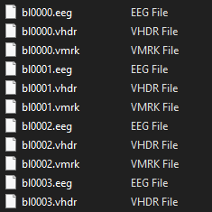

# EEG_data

## Initial Data Processing

### Required Files
My EEJacob library is needed for the data types in the processing and can be found [here](https://github.com/jacobWhite717/EEJacob). Make sure to add it to your MATLAB path.

EEGLAB is also required for the processing functions and can be obtained [from their website](https://sccn.ucsd.edu/eeglab/index.php).

### Processing Files
1. **brain_vision_to_pre_ica.m** : imports from brainvision recorder files, cleans and prepares data, and exports it to EEGLAB data formats.
2. **post_ica_to_durations.m** : extracts epochs and breaks up the trial durations into different EEGLAB files.
3. **durations_to_trial_container.m** : extracts trial types and calculates features, exports them to EEJacob TrialContainers. 

### Participant Trial Duration Ordering by BrainVision Block \#
If you wish to do your own processing from the raw data, the brainvision files saved correlate to the following trial duration blocks:

i.e. on these files:

| Number | 5s Blocks | 15s Blocks | 60s Blocks |
| --- | --- | --- | ---|
| 1-4 | / | / | / |
| 5 | 5-7 | 8-10 | 2-4 |
| 6 | 7-9 | 4-6 | 1-3 |
| 7 | 1-3 | 4-6 | 7-9 |
| 8 | 1-3 | 7-9 | 4-6 |
| 9 | 4-6 | 1-3 | 7-9 |
| 10 | 7-9 | 1-3 | 4-6 |
| 11 | 4-6 | 7-9 | 1-3 |
| 12 | 7-9 | 4-6 | 1-3 |
| 13 | 2-4 | 5-7 | 8-10 |
| 14 | 1-3 | 7-9 | 4-6 |
| 15 | 4-6 | 1-3 | 7-9 |
| 16 | 3-5 | 0-2 | 6-8 |

* Note that trial types (read, listen, rest) were randomized within blocks (by a deterministic seeding, but was not recorded) so you must extract them by the event flags (as done in **durations_to_trial_container.m**).
* Event flags for trial types:
  * reading: "R&nbsp;&nbsp;1"
  * listening: "L&nbsp;&nbsp;1"
  * rest: "N&nbsp;&nbsp;1" 
  * Note that there are 2 spaces between the letter and number for each.
* Also note that the initial 4 participants were for the pre-study and were ultimately not used for the final data set.

## Result Generation and Processing
1. Files like **run_classification_outer.m** and **run_classification_inner.m** were used to classify the binary mental state comparisions, i.e. read/rest, listening/rest, and read/listening.
   
2. **results_summarizer.m** and **results_randomized_summarizer.m** generated classifier performance tables in excel from the output of 1.

3. **stat_maker_true.m** and **stat_maker_rand.m** generated excel tables showing p-values and statistical significance for relevant comparisons from the output of 1.

4. **automated plot_makers/master_plot_maker.m** automatically generated formatted MATLAB figures from the output of 1.
